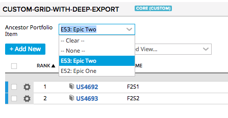
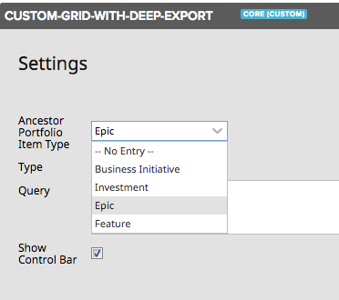

# @agile-central-technical-services/utils-ancestor-pi-app-filter

An app plugin that adds a ancestor portfolio item filter to the app. The plugin will:
* add an app setting that controls what portfolio item level to filter (e.g. Feature, Epic, etc)
* If the setting is enabled, search the app for a container with the id of
`Utils.AncestorPiAppFilter.RENDER_AREA_ID` and add a portfolio item picker.
* Dispatch a `Utils.AncestorPiAppFilter.PI_SELECTED` when the selected portfolio item is changed.
* Make the current portfolio item available as a filter relative to a given type.
(e.g. An Epic ancestor for a HierarchicalRequirement becomes `PortfolioItem.Parent = /portfolioitem/epic/1234`)




## Installation
1. Install using npm (or yarn) `npm install '@agile-central-technical-services/utils-ancestor-pi-app-filter' -D`
2. Add the file to the `javascript` section of `config.json`
    ```
     "javascript": [
        "node_modules/@agile-central-technical-services/utils-ancestor-pi-app-filter/index.js",
        ...
    ```

## Example usage

```
Ext.define("custom-grid-with-deep-export", {
    extend: 'Rally.app.App',
    items: [{
        id: Utils.AncestorPiAppFilter.RENDER_AREA_ID,
        xtype: 'container'
    }
    
    plugins: [{
        ptype: 'UtilsAncestorPiAppFilter',
        pluginId: 'ancestorFilterPlugin',
    }],
    
    launch: function() {
        this.getPlugin('ancestorFilterPlugin')
            .on(Utils.AncestorPiAppFilter.PI_SELECTED, function() {
            this._buildStore();
        }, this);
    },
    
    addGridboard: function() {
        var ancestorFilterPlugin = this.getPlugin('ancestorFilterPlugin');
        filters = filters.concat(ancestorFilterPlugin.getFiltersForType(this.modelNames[0]));
        
        this.gridboard = gridArea.add({
                xtype: 'rallygridboard',
                ...
                gridConfig: {
                    ...
                    storeConfig: {
                        filters: filters,
                    },
                }
        });
    }
```

## Developer Notes
To Update
1. `npm version patch` - This will update the package.json to a new version and create a git tag (e.g. `v1.0.1`). It will also run the `postversion` script
to push the changes and tag to GitHub.
2. `npm publish --access public` - This will publish the new version to npmjs.org
3. Create the new release in [`utils_file-utils/releases'](https://github.com/RallyTechServices/utils_file-utils/releases)

